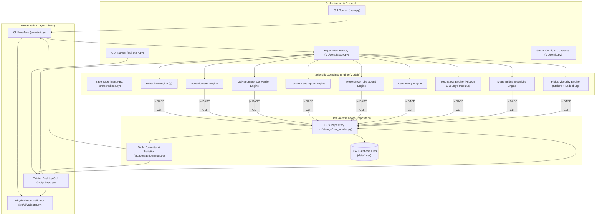
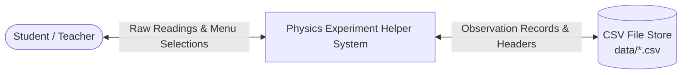
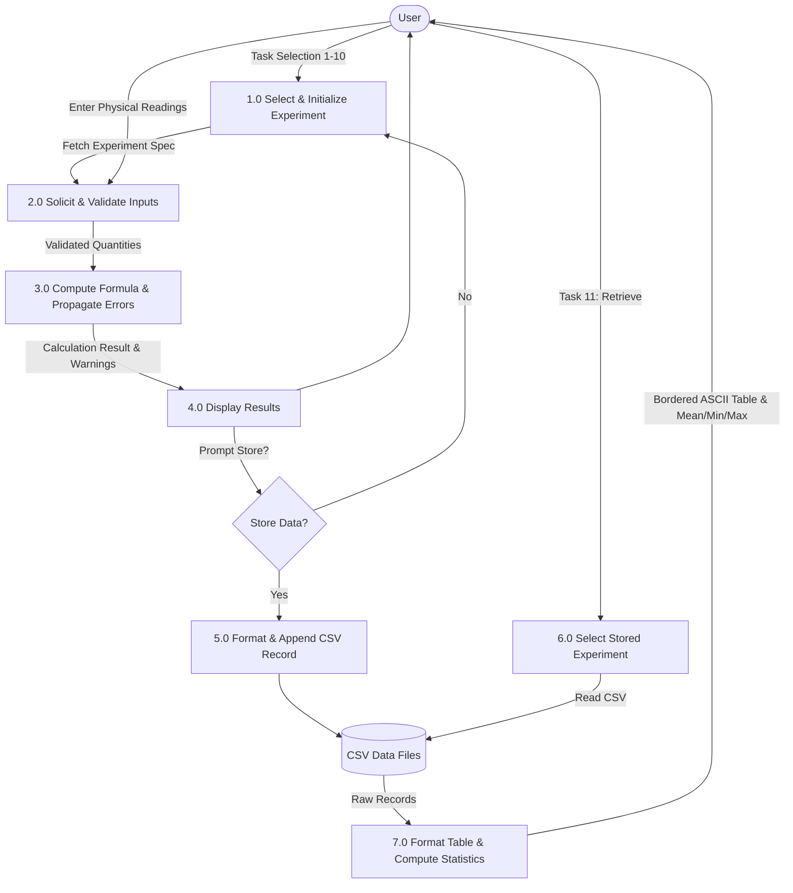
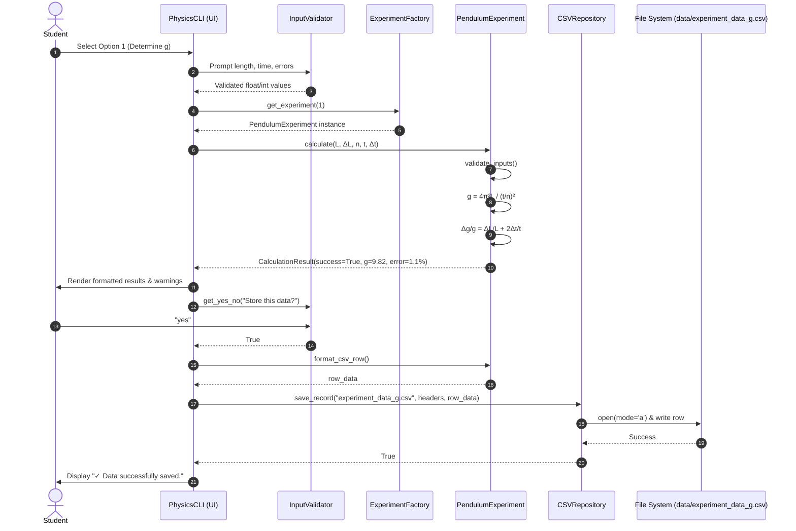
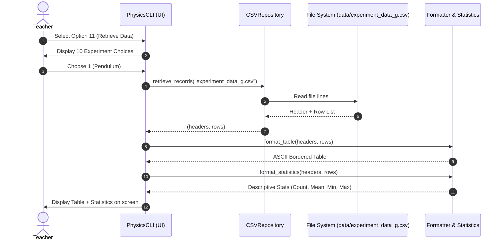

# System Architecture & Technical Design Document
## Physics Experiment Helper (CBSE Class XII - Subject Code 083)

---

## 1. Architectural Overview

**Physics Experiment Helper** adopts a clean, layered architectural design adhering to **Separation of Concerns (SoC)**, **SOLID principles**, and the **Model-View-Controller (MVC)** design pattern. It decouples high-precision scientific calculations, domain validation, data persistence, and user interfaces (both CLI and GUI).

### 1.1 High-Level Architectural Diagram

---

## 2. Component Decomposition

### 2.1 Domain Layer (`src/core/`)
The computational core is isolated from all I/O side effects, enabling 100% unit-testability and mathematical predictability.

- **`Experiment` (Abstract Base Class):** Enforces a uniform contract for all physics experiments:
  - `calculate(**kwargs) -> CalculationResult`
  - `validate_inputs(**kwargs) -> Tuple[bool, Optional[str]]`
  - `format_csv_row(inputs, result) -> List[Any]`
- **`CalculationResult` (Data Envelope):** Encapsulates calculation status, computed values, scientific error metrics, physical domain warnings, and error messages.
- **Experiment Modules:**
  - `pendulum.py`: Simple pendulum equation $g = \frac{4\pi^2 L}{T^2}$ with calculus-based fractional error propagation.
  - `potentiometer.py`: Potential gradient $k = E/L$ and balance length voltage $V = k \cdot l$.
  - `galvanometer.py`: Shunt resistance $S$ and multiplier resistance $R$.
  - `optics.py`: Two-pin convex lens displacement method $f = \frac{D^2 - x^2}{4D}$.
  - `sound.py`: Acoustic resonance velocity $v = 2f(l_2 - l_1)$ and end correction $e = \frac{l_2 - 3l_1}{2}$.
  - `calorimetry.py`: Principle of mixtures heat exchange $m_1 s_1 \Delta T_1 + m_2 s_2 \Delta T_2 = m_f s_f \Delta T_f$.
  - `mechanics.py`: Static friction coefficient $\mu = \frac{F_{max}}{mg}$ and Young's Modulus $Y = \frac{MgL}{\pi r^2 \Delta l}$.
  - `electricity.py`: Metre bridge Wheatstone balance $X = R \frac{l_1}{l_2}$ and absolute error $\Delta X$.
  - `fluids.py`: Stoke's terminal velocity with Ladenburg's cylindrical vessel wall correction factor $\left(1 + 2.4 \frac{r}{R}\right)$.

### 2.2 Storage Layer (`src/storage/`)
Implements the **Repository Pattern** to manage filesystem persistence.

- **`CSVRepository`:**
  - Encapsulates path resolution across `data/` directory, current directory, and legacy file aliases.
  - Guarantees schema consistency: checks file existence and automatically injects column headers on initial write.
  - Performs safe file reads with line sanitization and robust error catching.
- **`formatter.py`:**
  - Converts raw CSV records into dynamically aligned, bordered ASCII tables.
  - Computes statistical summaries (Count, Mean, Min, Max) for continuous numerical columns.

### 2.3 Presentation Layer (`src/ui/` & `src/gui/`)
Provides two interchangeable interfaces targeting different classroom scenarios.

- **CLI (`src/ui/cli.py`):**
  - Text-based terminal interface maintaining 100% backward compatibility with the CBSE menu numbers (1–12).
  - Uses `InputValidator` (`src/ui/validator.py`) for type safety and bounds validation without crashing.
- **Desktop GUI (`src/gui/app.py`):**
  - Native Tkinter/ttk desktop application.
  - Dynamic input form generation based on selected experiment.
  - Real-time formula display and physics warnings.
  - Built-in tabular CSV data viewer with scrollable `ttk.Treeview`.

---

## 3. Class Diagram

```mermaid
classDiagram
    class Experiment {
        <<abstract>>
        +int exp_id
        +str name
        +str description
        +str file_name
        +List~str~ headers
        +calculate(**kwargs)* CalculationResult
        +validate_inputs(**kwargs)* Tuple~bool, str~
        +format_csv_row(inputs, result)* List~Any~
    }

    class CalculationResult {
        +bool success
        +Dict~str, Any~ data
        +str error_message
        +List~str~ warnings
        +get(key, default) Any
    }

    class PendulumExperiment {
        +calculate(length, length_error, num_oscillations, time, time_error) CalculationResult
    }

    class PotentiometerExperiment {
        +calculate(emf, wire_length, error_wire_length, balance_length, error_balance_length) CalculationResult
    }

    class GalvanometerConversionExperiment {
        +calculate(G, ig, mode, i_target, v_target) CalculationResult
    }

    class ConvexLensDisplacementExperiment {
        +calculate(D, x) CalculationResult
    }

    class ResonanceTubeExperiment {
        +calculate(frequency, l1, l2) CalculationResult
    }

    class CalorimetryExperiment {
        +calculate(mode, m1, s1, dt1, m2, s2, dt2, mf, sf, dtf) CalculationResult
    }

    class FrictionExperiment {
        +calculate(mass, max_f, g, e_mass, e_max_f) CalculationResult
    }

    class YoungsModulusExperiment {
        +calculate(M, g, L, rw, dl) CalculationResult
    }

    class MetreBridgeExperiment {
        +calculate(R, l1, l2, error_in_R, lc) CalculationResult
    }

    class ViscosityExperiment {
        +calculate(rsph, rves, g, dsph, dliq, vt) CalculationResult
    }

    class CSVRepository {
        +Path data_dir
        +resolve_read_path(file_name) Path
        +resolve_write_path(file_name) Path
        +save_record(file_name, headers, row_data) bool
        +retrieve_records(file_name) Tuple
    }

    class PhysicsCLI {
        +CSVRepository repo
        +InputValidator validator
        +run() void
        +handle_pendulum() void
        +handle_retrieval() void
    }

    Experiment <|-- PendulumExperiment
    Experiment <|-- PotentiometerExperiment
    Experiment <|-- GalvanometerConversionExperiment
    Experiment <|-- ConvexLensDisplacementExperiment
    Experiment <|-- ResonanceTubeExperiment
    Experiment <|-- CalorimetryExperiment
    Experiment <|-- FrictionExperiment
    Experiment <|-- YoungsModulusExperiment
    Experiment <|-- MetreBridgeExperiment
    Experiment <|-- ViscosityExperiment

    Experiment ..> CalculationResult : returns
    PhysicsCLI --> Experiment : dispatches
    PhysicsCLI --> CSVRepository : persists & retrieves
```

---

## 4. Data Flow Diagrams (DFD)

### 4.1 DFD Level 0 (Context Diagram)

### 4.2 DFD Level 1 (System Process Flow)

---

## 5. Sequence Diagrams

### 5.1 Experiment Calculation and Storage Flow

### 5.2 Historical Record Retrieval Flow

---

## 6. Key Design Patterns Applied

| Pattern | Implementation Location | Architectural Purpose |
| :--- | :--- | :--- |
| **Strategy Pattern** | `src/core/*.py` | Implements polymorphic calculation strategies adhering to the `Experiment` base class. Adding an 11th experiment requires zero modification of existing experiment modules. |
| **Factory Pattern** | `src/core/factory.py` | Encapsulates experiment object instantiation, decoupling UI dispatchers from concrete class construction. |
| **Repository Pattern** | `src/storage/csv_handler.py` | Centralizes data access, path resolution, header initialization, and schema integrity away from presentation code. |
| **MVC Pattern** | Entire Project | Separates pure physical calculation models (`core/`), user presentation views (`ui/` and `gui/`), and orchestration controllers (`cli.py`, `app.py`). |

---

## 7. Comparative Analysis: Legacy Script vs Modern Architecture

| Feature / Metric | Legacy Script (`testingCS Project...docx`) | Modern Project Architecture |
| :--- | :--- | :--- |
| **Modularity** | Single 400+ line procedural script | 14 focused, single-responsibility modules |
| **Viscosity File Defect** | Saved to `experiment_data_Coeff_of_friction.csv`, corrupting friction records | Saved to dedicated `experiment_data_viscosity.csv` |
| **Calorimetry Defect** | Redundant duplicate definitions; broken syntax | Validated mode dispatcher (Specific Heat, Mass, Temp) |
| **Metre Bridge Error** | Reported relative fraction as absolute error | Computes absolute error $\Delta X$ and error percentage |
| **Input Validation** | None (negative mass, zero division crash) | Comprehensive physical range checks & reprompts |
| **Tabular Output** | Unformatted Python lists `['1.0', '0.01']` | Aligned ASCII bordered tables + statistics summary |
| **GUI Support** | None (terminal only) | Native Tkinter desktop app with live formula cards |
| **Automated Testing** | 0 tests | 20 unit tests with 100% pass rate in CI/CD format |
