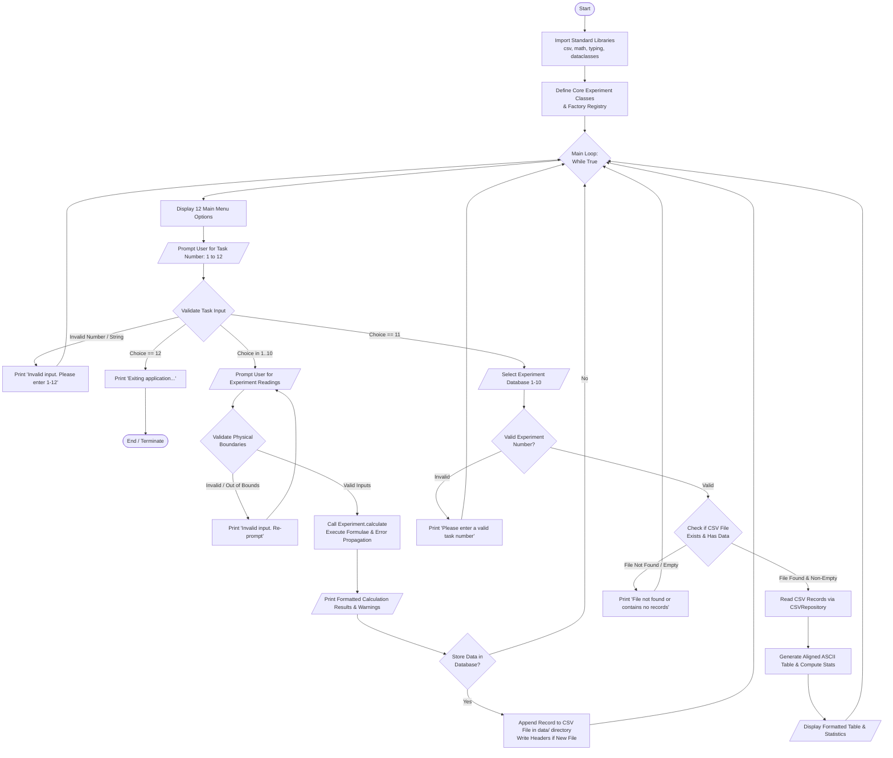
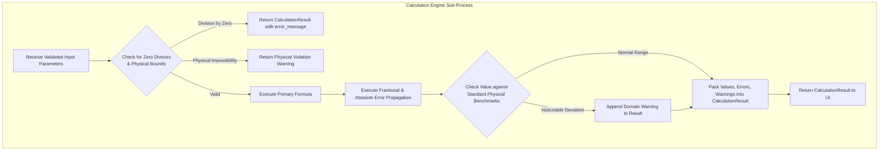
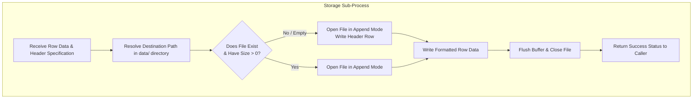

# Flowchart & Process Logic Documentation
## Physics Experiment Helper (CBSE Class XII - Subject Code 083)

---

## 1. System Master Flowchart

The following flowchart models the exact operational lifecycle and decision logic represented in the CBSE project documentation (corresponding to `image4.jpeg` from the project report):

---

## 2. Sub-Process Flowcharts

### 2.1 Experiment Calculation & Error Propagation Sub-Flow

### 2.2 CSV Persistence & Schema Enforcement Sub-Flow

---

## 3. CBSE Class XII Control Flow Table

| Step | State | Input | Condition / Validation | Transition |
| :---: | :--- | :--- | :--- | :--- |
| **01** | `INIT` | System boot | Load standard libraries & configuration | Move to `MENU_DISPLAY` |
| **02** | `MENU_DISPLAY` | None | None | Prompt user choice (1–12) |
| **03** | `MENU_SELECT` | Integer `exp_no` | `1 <= exp_no <= 12` | If 1–10: `EXP_PROMPT`; If 11: `RETRIEVE_PROMPT`; If 12: `EXIT`; Else: error |
| **04** | `EXP_PROMPT` | Float/Int measurements | Physical constraints (e.g. $L > 0$, $D > x$) | If valid: `CALCULATE`; Else: re-prompt |
| **05** | `CALCULATE` | Valid inputs | Formula evaluated, error propagated | Display results & move to `STORE_PROMPT` |
| **06** | `STORE_PROMPT`| String (`yes`/`no`) | Case-insensitive boolean check | If `yes`: `CSV_WRITE`; If `no`: `MENU_DISPLAY` |
| **07** | `CSV_WRITE` | Row data | File presence check | Append record, display confirmation, move to `MENU_DISPLAY` |
| **08** | `RETRIEVE` | Integer (1–10) | File existence check | Render ASCII table and summary stats, return to `MENU_DISPLAY` |
| **09** | `EXIT` | User choice 12 | None | Print goodbye and terminate process |
